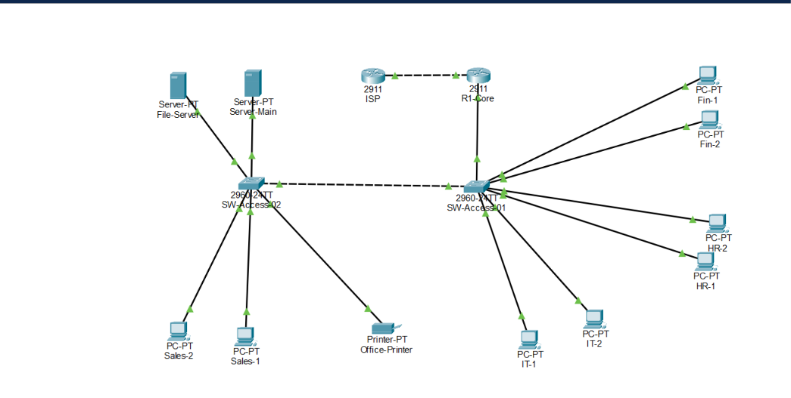

# Enterprise Network Architecture & Subnetting Implementation 🌐

## 📌 Project Overview
This project demonstrates a multi-department enterprise network architecture designed in **Cisco Packet Tracer**. The network isolates traffic for multiple departments (HR, Finance, Sales, IT, and Servers) using VLANs, implements Inter-VLAN Routing via Router-on-a-Stick, and configures automated IP allocation alongside edge WAN connectivity to an ISP.

---

## 🖼️ Network Topology

---

## 🏗️ Topology & Architecture
The topology is built using a two-tier model (Access Switches and Core Router):
* **Core Router (`R1-Core`):** Cisco 2911 handling Inter-VLAN Routing, DHCP Services, and Default WAN Routing.
* **Access Switches (`SW-Access-01` & `SW-Access-02`):** Cisco 2960 handling Access ports, Trunk links, and Spanning-Tree optimizations.
* **ISP Router:** Simulating upstream Internet Service Provider connectivity.

---

## 📐 IP Addressing & VLAN Scheme
The network uses the base network `192.168.10.0/24`, subnetworked into `/27` blocks to optimize host density:

| VLAN ID | Department | Subnet / Mask | Gateway IP | Usable Host Range |
| :--- | :--- | :--- | :--- | :--- |
| **VLAN 10** | HR | `192.168.10.0/27` | `192.168.10.1` | `192.168.10.2 - 192.168.10.30` |
| **VLAN 20** | Finance | `192.168.10.32/27` | `192.168.10.33` | `192.168.10.34 - 192.168.10.62` |
| **VLAN 30** | Sales | `192.168.10.64/27` | `192.168.10.65` | `192.168.10.66 - 192.168.10.94` |
| **VLAN 40** | IT | `192.168.10.128/27` | `192.168.10.129` | `192.168.10.130 - 192.168.10.158` |
| **VLAN 50** | Servers | `192.168.10.160/27` | `192.168.10.161` | `192.168.10.162 - 192.168.10.190` |
| **WAN Link** | R1 to ISP | `10.0.0.0/30` | `10.0.0.1` (R1) / `10.0.0.2` (ISP) | `10.0.0.1 - 10.0.0.2` |

---

## 🔧 Technical Implementation Details

1. **Inter-VLAN Routing (Router-on-a-Stick):**
   * Configured `802.1Q` encapsulation on sub-interfaces (`g0/0.10` through `g0/0.50`).
2. **Layer 2 Switching & Trunking:**
   * Configured IEEE 802.1Q trunks between Access Switches and Core Router.
   * Enabled `spanning-tree portfast` on edge access interfaces to eliminate standard 30-second STP listening/learning delays for end-user hosts.
3. **Dynamic IP Addressing (DHCP):**
   * Configured dedicated DHCP Pools directly on `R1-Core` for each VLAN with excluded default gateway ranges and custom DNS server definitions.
4. **WAN Connectivity & Routing:**
   * Configured point-to-point IP addressing on `Gi0/1` (`10.0.0.0/30`).
   * Implemented Static Default Route (`0.0.0.0/0`) towards ISP and return routes from ISP back to internal VLAN subnets.

---

## ⚠️ Challenges Encountered & Troubleshooting Solutions

### 1. STP Convergence Delays During DHCP Discovery
* **Issue:** When switching endpoints from Static IP to DHCP, clients timed out and received APIPA (`169.254.x.x`) addresses due to standard Spanning-Tree delays (Listening/Learning states).
* **Solution:** Applied `spanning-tree portfast` across all client-facing switch ports (`FastEthernet 0/1-24`), allowing instantaneous transition to the Forwarding state upon link activation.

### 2. Name Resolution Delay Mitigation
* **Issue:** Command typos in Cisco IOS triggered background domain lookups (`Translating "Command"...domain server`), freezing the terminal.
* **Solution:** Disabled domain lookups via `no ip domain-lookup` and utilized `Ctrl + Shift + 6` to break active DNS requests.

---

## 📁 Repository Files
* `Enterprise-Network.pkt`: Cisco Packet Tracer lab file.
* `README.md`: Project documentation and network specifications.
